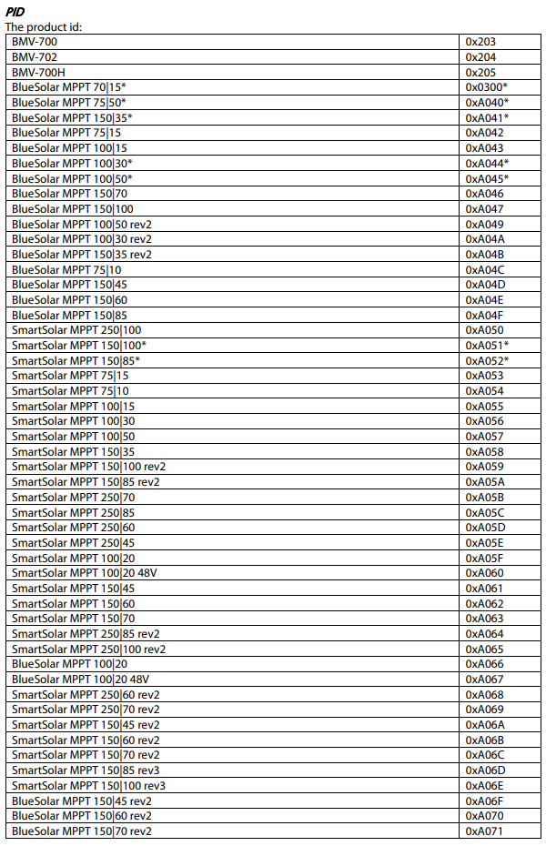
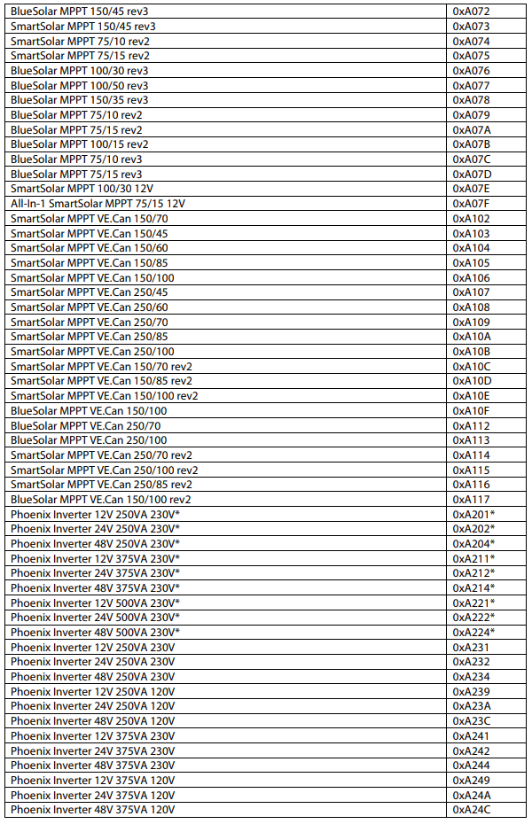
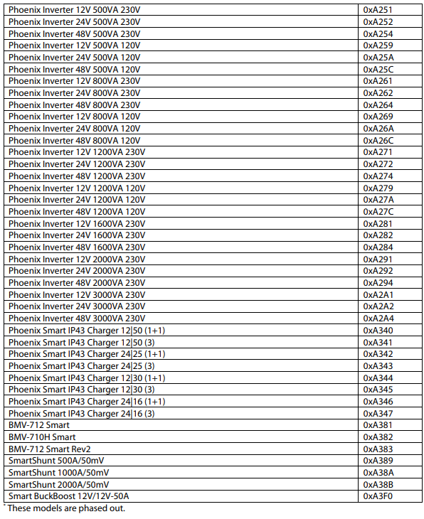

# FW Victron - Supported devices

Once the device is initialized, the script reads its data. Each data frame
contains the PID property, which is the **product ID of the connected device**.
The **device information is then retrieved from the PID mapping** in
the [mappings.py](/fw_victron/mappings.py) file, this file is based on
the [Devices by PID](#devices-by-pid) tables. 
Then, those info are used to initialize the DBus object with the correspondent
DBus iface and description. Both, the iface and the object description are
defined into the `PID` mapping.

TODO: rearrange source files to new firmware structure

* `model`: human-readable name of the exact model
* `type`: devices code to group similar devices
  from [_ve_definitions.py](/fw_victron/ve_definitions.py) as `DEV_TYPE_*`
* `dbus_iface`: a string defining the DBus iface 
  from [dbus_definitions.py](/fw_victron/dbus_definitions.py) as `DEV_IFACE_*`
* `dbus_desc`: a string defining the DBus object's description 
  from [dbus_definitions.py](/fw_victron/dbus_definitions.py) as `DEV_DBUS_DESC_*`.

## Device types

Here, you can find the list of all devices types available. Any product ID
from [Devices by PID](#devices-by-pid) section is mapped into a device type
using the `PID` table from the [mappings.py](/fw_victron/mappings.py) file.
More details on DBus definitions and their properties can be found on
the [Values Mapping](values_mapping.md#properties-by-dbus-object-description)
page.

| Type's Constant                       | Type's Name                | DBus's Iface                        | DBus's Description              |
|---------------------------------------|----------------------------|-------------------------------------|---------------------------------|
| `DEV_TYPE_BMV`                        | BMV                        | com.victron.BMV                     | --                              |
| `DEV_TYPE_BlueSolar_MPPT`             | BlueSolar MPPT             | com.victron.BlueSolarMPPT           | --                              |
| `DEV_TYPE_BlueSolar_MPPT_VECan`       | BlueSolar MPPT VE.Can      | com.victron.BlueSolarMPPTVECan      | --                              |
| `DEV_TYPE_SmartSolar_MPPT`            | SmartSolar MPPT            | com.victron.SmartSolarMPPT          | `DEV_DBUS_DESC_SmartSolar_MPPT` |
| `DEV_TYPE_SmartSolar_MPPT_VECan`      | SmartSolar MPPT VE.Can     | com.victron.SmartSolarMPPTVECan     | `DEV_DBUS_DESC_SmartSolar_MPPT` |
| `DEV_TYPE_Phoenix_Inverter`           | Phoenix Inverter           | com.victron.PhoenixInverter         | --                              |
| `DEV_TYPE_Phoenix_Smart_IP43_Charger` | Phoenix Smart IP43 Charger | com.victron.PhoenixSmartIP43Charger | --                              |
| `DEV_TYPE_SmartShunt`                 | SmartShunt                 | com.victron.SmartShunt              | --                              |

**NB!** Many device types do not have DBus definitions. The only devices that
are fully supported are SmartSolar MPPTs, because the first version was
developed with only one SmartSolar MPPT product available. If you have different
devices, you can send us their data trace so that we can correctly define the
corresponding DBus object description. To get the data trace, simply monitor the
serial port and copy what is sent by the device.

## Devices by PID

Here the full list of supported devices. This list comes from
the [VE.Direct-Protocol-3.33.pdf](/docs/VE.Direct-Protocol-3.33.pdf) file.

